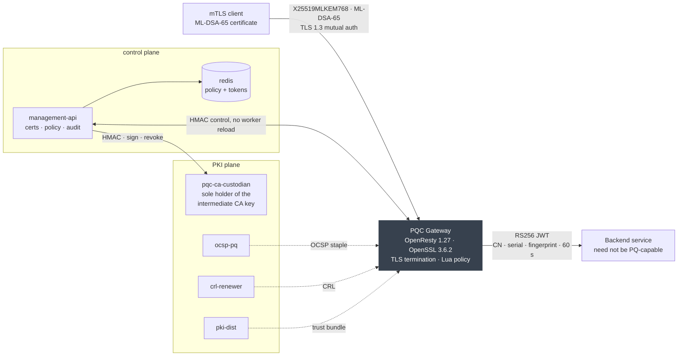

<div align="center">

# PQC mTLS Gateway

**A production-shaped API gateway where the key exchange *and* both peers' authentication are post-quantum.**

X25519MLKEM768 key agreement · ML-DSA-65 mutual authentication · native OpenSSL 3.6.2 · no OQS

[](https://github.com/PQC-RA/pqc-mtls-gateway/actions/workflows/bring-up.yml)
[](https://github.com/PQC-RA/pqc-mtls-gateway/actions/workflows/checks.yml)
[](LICENSE)
[](https://openssl-library.org/)
[](https://csrc.nist.gov/pubs/fips/204/final)

*Artifact for the IEEE CSCN 2026 paper. Every figure below is reproducible from this repository.*

</div>

---

ML-KEM and ML-DSA are finalised and native in OpenSSL 3.5 onward, so the components exist. What is
poorly characterised is a **complete** deployment: post-quantum key exchange **and** post-quantum
authentication on **both** peers, with those certificates traversing a production edge.

This is one, measured. It terminates TLS 1.3 at an OpenResty edge linked against an unmodified,
side-installed OpenSSL 3.6.2, with **no OQS provider and no patched library**. It enforces mTLS
with CRL revocation, and hands a short-lived attested identity to backends that do not need to be
post-quantum capable at all.

> [!NOTE]
> **The cryptography is not the expensive part. Size is.** CPU cost is about 2.9× a classical
> baseline; the handshake carries 9.3× the bytes. Everything that actually broke in this deployment
> broke on size, or on a policy that was never enforced. See [What breaks](#what-breaks).

---

## Results at a glance

Measured **2026-08-04** on the reference testbed: one LXC guest, i9-11950H (8 cores), 8 GiB,
Ubuntu 24.04, OpenSSL 3.6.2. Absolute timings scale with the host; **byte counts and enforcement
behaviour do not**, and those are the figures to compare first.

| | Value | Configuration it belongs to |
|---|---:|---|
| Median TLS handshake, full edge | **4.57 ms** | `time_appconnect − time_connect`, N=200, fresh process per connection |
| Single-core CPU vs classical | **≈2.9×** | paired `s_server`/`s_time`, one core, resumption off |
| Handshake bytes vs classical | **9.3×** | 21,277 vs 2,285 B, controlled arms, leaf-only both ways |
| ML-DSA-65 client leaf | **6,134 B** | DER on the wire |
| …URL-escaped into an HTTP header | **9,050 B** | past the 8,192 B default single-header buffer |
| Server flight, no staple | **11,071 B** | fits TCP's initial window (IW10 = 14,480 B) |
| Server flight, stapled | **20,540 B** | does not; costs **+51 ms ≈ 1 RTT** at 50.1 ms RTT |
| Client chain as deployed | **22,481 B** | full chain *including the root* |
| …leaf-only | **21,682 B** | RFC 8446 §4.4.2 permits omitting a trust anchor, a 35 % saving |

The CPU ratio is run-dependent: seven measurements across three hosts span **2.1×–3.1×**, so read
it as indicative. The mechanism behind it is not: swapping the hybrid group for standalone
ML-KEM-768 moves the CPU-normalised rate by ≈4 %, so the cost is dominated by **ML-DSA-65
authentication, not key exchange**.

The staple penalty is deliberately stated as a duration and a round trip rather than a percentage. A ratio
taken with a stopwatch that includes more shared network time reports a different number for the
same system. Durations and round-trip counts survive a change of instrument.

---

## Architecture



Eight services across four bridge networks. The management API holds **zero filesystem access to the
CA tree**; every signing and revocation operation goes through the custodian sidecar over an
HMAC-authenticated internal API. The gateway mounts the CA tree with the private-key subdirectories
masked, so the internet-facing component never sees a CA private key either.

| Service | Role |
|---|---|
| `gateway` | OpenResty edge: PQC TLS termination, mTLS, CRL check, routing, JWT minting |
| `management-api` | NestJS control plane: certificate lifecycle, routing policy, CRL, audit |
| `pqc-ca-custodian` | Intermediate-CA signing sidecar, the **only** component with access to the intermediate private key |
| `redis` | Durable routing-policy and enrollment-token store; refuses to start under `NODE_ENV=production` if absent |
| `ocsp-pq` | OCSP responder over the ML-DSA-65 chain |
| `crl-renewer` | Periodic CRL regeneration |
| `pki-dist` | Serves CA certificates and CRLs over HTTP |
| `shadow-mock` | Bundled test backend, **dev only**, removed by `./scripts/teardown.sh --test-only` |

The management API is a separate repository, consumed here as a digest-pinned image:
[`PQC-RA/pqc-mtls-management-api`](https://github.com/PQC-RA/pqc-mtls-management-api). A plain
`git clone` of this repo is enough to deploy, with no submodules and no `--recursive`.

---

## Quick start

**Prerequisites:** a Linux host (Ubuntu 22.04 / 24.04 recommended) and root. Docker, Compose v2 and
the build toolchain are installed by the deploy script if missing.

```bash
git clone https://github.com/PQC-RA/pqc-mtls-gateway.git
cd pqc-mtls-gateway
sudo ./scripts/deploy.sh
```

Then confirm the handshake is genuinely post-quantum on both sides:

```bash
echo | OPENSSL_CONF=/etc/ssl/openssl.cnf /opt/openssl/bin/openssl s_client \
  -connect 127.0.0.1:443 -CAfile /etc/pki/pqc-ca/ca-chain.crt \
  -cert ./admin-cert/gateway-admin.crt -key ./admin-cert/gateway-admin.key -tls1_3 2>&1 \
  | grep -E 'Negotiated|Peer signature'
# Negotiated TLS1.3 group: X25519MLKEM768
# Peer signature type: mldsa65
```

<details>
<summary><b>What <code>deploy.sh</code> actually does</b></summary>

1. **Fetches the base images**, PQ OpenSSL 3.6.2 and OpenResty 1.27.1.2, by the digests in
   `base.lock`. Falls back to compiling from source (~30 min) only if the pull is unavailable.
2. **Installs PQ OpenSSL** to `/opt/openssl-<ver>`, aliased `/opt/openssl`, the path everything else
   resolves.
3. **Bootstraps the PKI**: ML-DSA-65 root → intermediate → server cert, OCSP cert, CRLs. The
   server IP is auto-detected into the certificate SAN. Skipped if a PKI already exists.
4. **Issues a bootstrap admin certificate** to `./admin-cert/` and writes its SHA-256 fingerprint
   into `ADMIN_CERT_FINGERPRINTS` in `.env`. No manual fingerprint step.
5. **Generates gateway secrets**, the RSA-2048 JWT signing keys and the control-plane HMAC.
6. **Builds the images and starts the stack.**

Useful flags: `--server-ip IP` overrides SAN auto-detection; `--rebuild-artifacts` ignores the
published base image and builds PQ OpenSSL from source.

</details>

---

## What breaks

Three operational failure modes this deployment hit, all in the middleware rather than in the
cryptography, and **all three invisible to a configuration test and a health check**. They are the
subject of the paper; the harness in `bench/` reproduces the evidence for each.

### 1 · Application: certificate size overruns default header buffers

An ML-DSA-65 client certificate is 6,134 B. URL-escaped into a proxy header it becomes **9,050 B**,
past the **8,192 B** default single-header buffer of nginx *and* of the nginx backend behind it.

> **How it hides.** The TLS handshake succeeds. The failure surfaces only as a generic `HTTP 400`,
> with no mention of size, before any application logic runs. 100 % of authenticated requests fail
> while every component reports itself healthy.

**Fix.** `large_client_header_buffers 4 32k` at *every* hop that parses the header, paired with a
request-header timeout, since a larger buffer widens the slow-header DoS surface. The structural fix
is to keep certificates out of headers entirely, which is what this deployment now does. The
per-route `sendRawCert` option re-enables the old path for testing.

This is not an nginx quirk. Apache's `LimitRequestFieldSize` defaults to 8190, and comparable limits
across proxies, load balancers, WAFs and API gateways were all calibrated for 1–2 KB classical
certificates.

### 2 · Authentication: a post-quantum CA does not give post-quantum authentication

Chain validation checks that a leaf is *signed by* a trusted CA. It never constrains the leaf's
**own** subject key: in RFC 5280 path validation the subject key algorithm is an *output*, never an
input to a check. So an RSA-2048 client certificate issued by the legitimate ML-DSA-65 intermediate
chain-validates perfectly. TLS 1.3 client authentication is also algorithm-agile, so a server that
does not restrict the accepted signature algorithms advertises classical options in its
`CertificateRequest`.

> **How it hides.** An *invalid* directive is caught loudly: the configuration test fails and the
> worker refuses to start. An *omitted* one is not: it passes validation, starts, and runs
> unrestricted.

**The fix takes two enforcement points, not one.** At the handshake:

```nginx
ssl_conf_command ClientSignatureAlgorithms ML-DSA-65;
```

and a key-algorithm check at issuance. Either alone leaves a path open.
`bench/check-negative-controls.sh` mints an RSA and an EC leaf that the issuance path refuses to
produce, signing each out-of-band **with the real intermediate key**. It then routes that
certificate, so that any refusal is attributable to TLS rather than to policy, and asserts that the
handshake rejects it.

### 3 · Transport: OCSP stapling costs a round trip, not only bytes

Stapling works correctly for the ML-DSA-65 chain; the frequent claim that it does not is wrong. What
it costs is a round trip. The staple adds **9,469 B**, dominated by the embedded signer certificate,
taking the server's opening flight from 11,071 to **20,540 B**, past TCP's initial congestion window
(IW10 = 10 × 1448 = **14,480 B**).

> **How it hides.** Nothing fails. Every response is correct; the deployment simply pays one extra
> round trip, **+51 ms** at a measured 50.1 ms RTT. Invisible on a LAN, and it never appears in any
> log.

The packet capture in [`bench/2026-08/results/staple-cwnd.pcap`](bench/2026-08/results/staple-cwnd.pcap)
shows the flight stall at exactly 14,480 B and resume one round trip later.

**Fix.** The penalty belongs to the window, not to the algorithm. Raising `initcwnd` removes it, and
so does not stapling. The trade is revocation freshness against one round trip.

> **The rule all three share:** verify a security control by **observing the protocol**, not by
> reading the configuration.

---

## Issuing client certificates

In both modes the operator generates their own ML-DSA-65 key pair locally, so **the private key never
leaves the machine.**

<details open>
<summary><b>Admin-direct</b>: you hold admin credentials, and the enrollment token is created for you</summary>

```bash
PQC_GATEWAY=https://127.0.0.1 \
PQC_CA_CHAIN=/etc/pki/pqc-ca/ca-chain.crt \
PQC_ADMIN_CERT=./admin-cert/gateway-admin.crt \
PQC_ADMIN_KEY=./admin-cert/gateway-admin.key \
./scripts/issue-cert.sh <cn> <backend-url>
```

Passing a backend URL also creates the routing policy in the same step.

**From a remote machine**, copy the credentials `deploy.sh` prints, plus the enrollment CA:

```bash
scp root@<server>:<repo>/admin-cert/gateway-admin.{crt,key} .
scp root@<server>:/etc/pki/pqc-ca/ca-chain.crt .
scp root@<server>:/etc/pki/pqc-ca/enroll-classical-ca.crt ./enroll-ca.crt
chmod 600 gateway-admin.key

PQC_GATEWAY=https://<server-ip> PQC_ENROLL_CA=./enroll-ca.crt \
  ./issue-cert.sh <cn> <backend-url>
```

`PQC_ENROLL_CA` is the CA behind the **:8443 enrollment listener's** server certificate, a
classical ECDSA cert distinct from the ML-DSA chain. It is auto-detected on the server itself and
only needed remotely.

</details>

<details>
<summary><b>Self-enrollment</b>: the operator has no admin credentials</summary>

An admin pre-issues a CN-constrained token out-of-band:

```bash
curl -sk --cacert $CA_CHAIN --cert $ADMIN_CERT --key $ADMIN_KEY -H "X-PQC-CSRF: 1" \
  -X POST "https://<server>/admin/certs/enrollment-tokens?cn=<cn>&ttl=86400"
# → { "token": "enroll_...", "expiresAt": ..., "allowedCn": "<cn>" }
```

The operator then enrolls autonomously against port 8443, with no mTLS client certificate:

```bash
ENROLLMENT_TOKEN=enroll_xxx PQC_GATEWAY=https://<server-ip> \
PQC_CA_CHAIN=./ca-chain.crt PQC_ENROLL_CA=./enroll-ca.crt \
./issue-cert.sh <cn>
```

Tokens are single-use, TTL-bounded and atomically consumed. The CSR subject CN must match
`allowedCn` exactly; a mismatch returns 403 **without** consuming the token.

</details>

<details>
<summary><b>How the script finds a PQ-capable OpenSSL</b> (including macOS)</summary>

1. **Native**, if a binary with ML-DSA-65 support is on `PATH`, at `/opt/openssl/bin/openssl`, or at
   `PQC_OPENSSL=<path>`. On macOS that is Homebrew's OpenSSL 3.5+:
   ```bash
   brew install openssl@3
   PQC_OPENSSL=/opt/homebrew/bin/openssl ./issue-cert.sh <cn> <backend-url>
   ```
   The script drives `openssl s_client` directly rather than `curl`, because system curl, whether
   macOS LibreSSL or an older Linux build, can neither negotiate X25519MLKEM768 nor load an
   ML-DSA-65 client certificate.
2. **Docker fallback**, only if no PQ OpenSSL is found: it re-execs inside the digest-pinned
   PQ-OpenSSL base image. Multi-arch, so Apple Silicon runs it natively, with no Rosetta and no
   registry login.

</details>

> [!IMPORTANT]
> `X-PQC-CSRF: 1` is required on **every mutating admin call**. A cross-site browser cannot set it,
> because its CORS preflight is blocked, so a CLI that sets it explicitly is authorised without
> needing a browser-console `Origin`. `issue-cert.sh` sends it for you; only hand-rolled `curl`
> needs it.

---

## Routing policies

A client certificate alone does not move traffic. The gateway routes each request by the client's
CN, so **every CN needs a policy**: backend, rate limit, allowed paths. Without one the gateway has
nowhere to send the request.

```bash
# Issue and route in one step, against the bundled test backend
./scripts/issue-cert.sh demo-service http://shadow-mock:80
```

Or manage policies directly over mTLS:

```bash
ADMIN="curl -sk --cacert ca-chain.crt --cert admin.crt --key admin.key -H X-PQC-CSRF:1"

$ADMIN -X PUT https://<server>/admin/policy/routes/demo-service \
  -H 'Content-Type: application/json' \
  -d '{"backend":"http://shadow-mock:80","rate_limit":{"rps":100,"burst":200},"allowed_paths":["/api/","/status/"]}'

$ADMIN https://<server>/admin/policy/routes/demo-service          # inspect
$ADMIN -X DELETE https://<server>/admin/policy/routes/demo-service # remove
```

Policies are persisted and survive restarts. Updates reach the data plane **without a worker
reload**, over the HMAC-authenticated control channel.

> The backend must resolve on a gateway network. `shadow-mock` is the bundled test service;
> `http://my-backend:8080` in any example is a placeholder. Replace it, or you will get a `502`.

---

## Reproducing the paper's figures

`bench/` carries the harness, the raw per-sample data, the packet capture, and the commands that
recompute each published figure. [`bench/EXPECTED-RESULTS.md`](bench/EXPECTED-RESULTS.md) records
what every script returned on the reference testbed, so a re-run can be **checked rather than
trusted**. It also names the rig each figure belongs to, because a figure from one rig is not
comparable with a figure from another.

```bash
# 1. Issue the identity the live-gateway arms use, from the repository root.
if [ ! -f certs/bench-client/bench-client.crt ]; then
  PQC_GATEWAY=https://127.0.0.1 PQC_CA_CHAIN=/etc/pki/pqc-ca/ca-chain.crt \
  PQC_ADMIN_CERT=./admin-cert/gateway-admin.crt \
  PQC_ADMIN_KEY=./admin-cert/gateway-admin.key \
  ./scripts/issue-cert.sh bench-client http://pqc-shadow-mock:80
fi

export EXPORT=$PWD/bench-identity && mkdir -p "$EXPORT"
cp certs/bench-client/bench-client.crt "$EXPORT/client.crt"
cp certs/bench-client/bench-client.key "$EXPORT/client.key"
cp /etc/pki/pqc-ca/ca-chain.crt        "$EXPORT/ca-chain.crt"

# 2. Run the whole harness.
cd bench && ./run-all.sh
```

`run-all.sh` checks the testbed and records it to `PROVENANCE.md`, builds the hermetic comparison
arms, runs the verification suite and the negative controls, measures wire bytes, throughput, the
live gateway and the three hermetic latency arms, then summarises with `stats.py`. It stops at the
first failure rather than carrying on with a broken arm, and refuses to proceed past a failed
`preflight.sh`.

> [!TIP]
> `preflight.sh` installs missing measurement tools and refuses to run on a testbed that would
> produce invalid numbers: a stopped container, a missing route, swap activity, or a load average
> above 1.0. **Read its output rather than skipping past it.** Several retracted figures in this
> project's history came from tools that did not crash.

It deliberately omits what needs root `netem`, a second machine, or a VPN, namely
`netem-sweep.sh`, `rtt-proof.sh`, `rtt-cwnd2.sh` and `concurrency-from-client.sh`. It also omits the
matched-PKI chain, which is a separate rig. [`bench/README.md`](bench/README.md) documents every
script, and `run-all.sh`'s header lists what it skips and why.

<details>
<summary><b>Running the steps individually</b></summary>

```bash
cd bench
./preflight.sh                     # must end "PREFLIGHT OK". If it does not, stop.
./gen-provenance.sh                # CPU/RAM/OpenSSL/HEAD → PROVENANCE.md

# The hermetic arms. throughput3.sh and wirebytes.sh measure THESE, not the live
# gateway, so skipping this makes both report FAILED / ERR for every row.
./setup-classical-arm.sh           # hybrid :4433 + classical :4434
./add-pure-arm.sh                  # pure ML-KEM-768 :4435

./verify-suite.sh                  # cert sizes, OCSP staple, PQC-only enforcement
./throughput3.sh 10 3              # three arms, CPU-normalised
./wirebytes.sh                     # handshake byte budget

# Latency, all four arms. Needs a PQC-capable curl, which the deploy provides;
# confirm with `curl -V` (expect OpenSSL/3.6).
./measure-latency.sh gw-pqc-sni https://pqc-gw.local/api/v1/status \
    "$EXPORT" X25519MLKEM768 220 pqc-gw.local:443:127.0.0.1
./measure-latency.sh herm-pqc       https://127.0.0.1:4433/ hermetic/pqc       X25519MLKEM768
./measure-latency.sh herm-pure      https://127.0.0.1:4435/ hermetic/pqc       MLKEM768
./measure-latency.sh herm-classical https://127.0.0.1:4434/ hermetic/classical X25519
./stats.py *.dat
```

</details>

### Continuous integration

`bring-up.yml` deploys the entire stack from scratch on a clean runner on every pull request, on
every push to `main`, after a base-image publish and weekly on a schedule. It then asserts that
every image
shipping `/opt/openssl` resolves bare `openssl` to it, scans the built images for leaked secrets,
runs the smoke test, and drives an **end-to-end issuance test**: issue a certificate, route it, make
an mTLS request, assert the backend response, revoke. `checks.yml` runs hadolint, shellcheck,
actionlint and an OpenSSL version-consistency gate.

---

## Security model

| | |
|---|---|
| **Key exchange** | X25519MLKEM768 (hybrid classical + ML-KEM-768, FIPS 203) |
| **Authentication** | ML-DSA-65 (FIPS 204) on **both** peers, throughout a three-tier PKI |
| **Revocation** | CRL checked in the data plane; OCSP responder over the ML-DSA-65 chain |
| **Admin authorisation** | client-certificate **SHA-256 fingerprint allowlist**, not subject fields and not OU |
| **Control channel** | HMAC-authenticated with a replay window, constant-time comparison |
| **Backend identity** | short-lived RS256 JWT carrying CN, serial and the certificate's SHA-256 fingerprint |

- Private keys for the CA, the server and JWT signing, the HMAC secret, client artifacts and build
  binaries are all
  **gitignored and never committed**. Each deployment generates its own CA and secrets; do not share
  key material between environments.
- `management-api` runs as a non-root service account with **no mount of the CA tree at all**.
  Signing, revocation and reads of the CA index go through the `pqc-ca-custodian` sidecar over an
  HMAC-authenticated internal API. The gateway mounts the CA tree with the private-key
  subdirectories masked, so the internet-facing component never sees a CA private key.
- **Four classical elements remain, and naming them is part of the result:** the ECDSA P-256 server
  certificate on the `:8443` enrollment bootstrap channel and its self-signed CA, the classical
  fallback group offered there, and the RS256/RSA-2048 JWT used for backend identity hand-off. The
  JWT is a deliberate trade: an ML-DSA-65 signature on a token that rides every proxied request would
  recreate the header-size problem this project exists to document.

<details>
<summary><b>Admin authorisation, in practice</b></summary>

`deploy.sh` issues a bootstrap admin certificate and writes its fingerprint into
`ADMIN_CERT_FINGERPRINTS` in `.env`. To add another admin, issue a certificate, take its
fingerprint, append it comma-separated, and restart the control plane:

```bash
/opt/openssl/bin/openssl x509 -in admin.crt -noout -fingerprint -sha256 \
  | sed 's/.*=//; s/://g' | tr 'A-F' 'a-f'

docker compose up -d management-api
```

The allowlist **fails closed** if empty. `scripts/verify-admin-sha256.sh` checks the whole path from
a real certificate.

</details>

---

## Repository layout

```
config/nginx/         gateway configuration and the Lua data plane
  lua/policy_router.lua    CN → backend resolution, JWT minting, header allowlist
  lua/crl_worker.lua       CRL polling and the revocation fast path
docker/               image definitions, including the PQ OpenSSL base
scripts/              deploy, PKI bootstrap, certificate issuance, tests
bench/                measurement harness, raw samples, packet capture
  EXPECTED-RESULTS.md      what every script returned on the reference testbed
  2026-08/                 the camera-ready campaign
pki/                  OpenSSL CA configuration templates
```

<details>
<summary><b>Script reference</b></summary>

| Script | Purpose |
|---|---|
| `scripts/deploy.sh` | One-shot deployment of the full stack from a bare Linux host |
| `scripts/teardown.sh` | `--test-only` removes shadow-mock and test certs; `--all` removes services, volumes, host PKI and OpenSSL |
| `scripts/issue-cert.sh` | Issue an ML-DSA-65 client certificate, self-enrollment or admin-direct, native PQ OpenSSL or Docker fallback |
| `scripts/setup-pki.sh` | Bootstrap the ML-DSA PKI, and assert the deployed CAs carry ML-DSA keys |
| `scripts/generate-gateway-secrets.sh` | JWT signing keys and the control-plane HMAC |
| `scripts/pqc-crl-renew.sh` | Regenerate CRLs |
| `scripts/verify-admin-sha256.sh` | Verify the admin fingerprint allowlist end to end |
| `scripts/test-stack-smoke.sh` | All containers running and healthy |
| `scripts/test-issuance-e2e.sh` | Issue → route → mTLS request → 200 → revoke, against a live gateway |
| `bench/run-all.sh` | The whole measurement campaign |
| `bench/check-negative-controls.sh` | The checks that must fail closed, including the classical-leaf handshake bypass |

</details>

<details>
<summary><b>Configuration reference</b></summary>

Deploy-specific values live in a **`.env`** at the repository root, which Compose substitutes into
`docker-compose.yml`. It holds real per-deployment values and is **gitignored, so never commit it**.
The value-less template is `.env.example`; `deploy.sh` copies it for you.

| Where | Key | Purpose |
|---|---|---|
| `.env` | `ADMIN_CERT_FINGERPRINTS` | Admin authorisation allowlist. Auto-written by `deploy.sh`; fails closed if empty |
| `.env` | `CORS_ALLOWED_ORIGINS` | Web origins allowed to call the management API. Empty means no cross-origin access |
| compose | `JWT_EXPECTED_ISSUER` / `JWT_EXPECTED_AUDIENCE` | JWT validation pinning |
| `secrets/` | `gateway-signing.key` | RSA-2048 JWT signing key (generated, gitignored) |
| `secrets/` | `control-plane-hmac.key` | Control-channel HMAC secret (generated, gitignored) |

</details>

---

## Citing this work

```bibtex
@inproceedings{doynov2026pqcmtls,
  author    = {Doynov, Rumen and Nenova, Maria and Shestakov, Alexander},
  title     = {Deploying Post-Quantum Mutual {TLS} 1.3 with {ML-KEM} and {ML-DSA}:
               An Operational and Standards-Readiness Study of a Native-OpenSSL Gateway},
  booktitle = {2026 IEEE Conference on Standards for Communications and Networking (CSCN)},
  year      = {2026},
  address   = {London, United Kingdom},
  publisher = {IEEE},
  note      = {Poster. Artifact: \url{https://github.com/PQC-RA/pqc-mtls-gateway}}
}
```

**Acknowledgment.** This work was supported by project BG05SFRP001-3.004-0025-C01, “DUNIZVICT”.

---

## Licence

**AGPL-3.0-only.** Full text in [LICENSE](LICENSE).

```
pqc-mtls-gateway: a mutual-TLS API gateway with post-quantum client authentication
Copyright (C) 2026 Alexander Shestakov
Copyright (C) 2026 Rumen Doynov

This program is free software: you can redistribute it and/or modify it under the
terms of the GNU Affero General Public License, version 3, as published by the Free
Software Foundation.

This program is distributed in the hope that it will be useful, but WITHOUT ANY
WARRANTY; without even the implied warranty of MERCHANTABILITY or FITNESS FOR A
PARTICULAR PURPOSE. See the GNU Affero General Public License for more details.

You should have received a copy of the GNU Affero General Public License along with
this program. If not, see <https://www.gnu.org/licenses/>.
```
